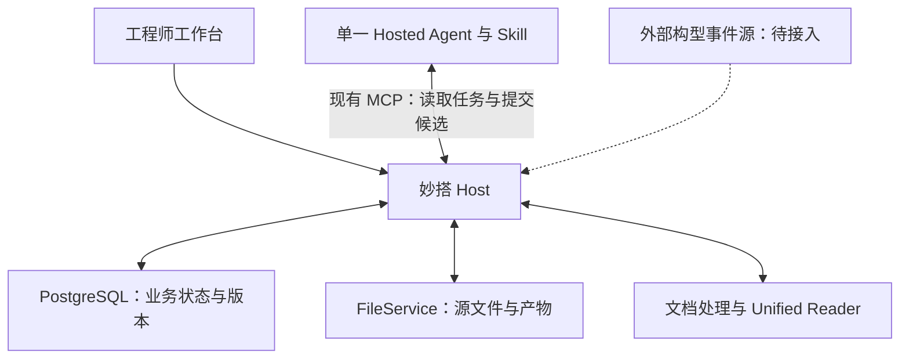

# WiseLink R10 当前设计、系统盘点与实施顺序

盘点及设计修订日期：2026-09-05（Asia/Shanghai）。运行状态来自本日只读盘点；产品目标和实施顺序按用户随后明确的设计理念修订。本文区分已实现能力与待实施目标，不新增开发契约、baseline 或验收 gate。本次设计修订不代表业务代码或线上功能已经变更。

同步结果：R10 云文档已更新并回读至 revision 2069。第 1、2、6.4、7、8、9、10.4、11 节反映本次方向；第 12 节增加当前运行摘要并明确旧记录的历史属性。原有图表和历史运行记录保留，旧的串行推进说明已由现行正文替代，可通过云文档版本历史追溯。

## 1. 总体判断

WiseLink 已形成可部署的工程评估系统，文档解析、翻译、适用性、150 项 Job-Aid、综合候选、显式关联上下文和多轮 Review 都有实际运行证据。当前适合继续受控试用和产品化迭代，但不能把“由主控启动 Hosted driver 后成功”直接等同于“工程师在页面上可以独立连续使用”。

Host、单一 Hosted Agent 和现有数据基础可以保留，但运行方式需要调整：以“面向工程问题的上下文评估包”为中心，将有解释价值的关联材料和知识片段实际用于 Job-Aid、综合判断及持续复核。上下文不能长期只是预览，Review 也不能只有多轮记录而缺乏连续调查与干预能力。

开发优先形成能实际使用的完整流程，在运行反馈中修订。此前把 Issue Thread 和 RAG 整体后置，以及“唯一剩余阻断是构型 SoR”的安排均不再作为当前推进顺序。后置的是复杂图谱和全量知识建设，不是基本的问题脉络与知识背景。

## 2. 工作思路与业务目标

产品目标是把工程文件中的信息按业务语义组织起来，结合与该工程问题真正相关的材料、知识空间检索片段及工程师输入，形成可持续更新的上下文评估包。智能体以此理解问题、按照 Job-Aid 等评估方法开展调查和判断，再形成综合评估；工程师在持续会话中提问、调整方向和补充信息。

### 2.1 按工程问题组织，不按文件目录堆积

重点组织问题现象、影响范围、机理分析、调查进展、临时措施、最终措施、实施前提、运营影响、文件发布及改版里程碑。以用户描述的 Boeing 问题链为业务示例：航司问答邮件可能提供早期信号，FTD 跟踪调查和措施演进，后续说明性文件、改装方案、维护提示和手册改版贡献不同信息。这是可分支、可回溯的业务脉络，不是每个事项必经的固定文件发布顺序；具体文件类型以原文识别为准。

一份文件可承担多种贡献作用；同一事项也可能涉及多个问题。先复用现有文档身份、SourceRef、关系候选和普通时间线表达，不先建设全量知识图谱。

关联资料是否装入模型上下文，取决于“具体片段能帮助回答什么评估问题”，而不是是否被引用、是否属于某种文件类型。纯施工操作型 AMM 工卡通常不自动装入机理分析背景；如果评估点涉及施工条件、工具、接近、停场或维修要求，则按需读取其中相关部分。保留引用索引，不要求导入或阅读所有引用文件。

### 2.2 上下文评估包是统一工作材料

逻辑上包含以下内容，优先复用已有对象和存储，不为每一部分增加新表、hash 或冻结结构：

| 内容 | 为评估提供什么 |
| --- | --- |
| 当前文件与事项 | 原文语义、目标对象、评估时间、已知条件和工程师关注点 |
| 问题脉络与关联片段 | 原因、进展、措施演变、前置条件和发布里程碑；保留来源及选择理由 |
| RAG 与其他外部背景 | 实际命中的知识片段、来源、相关问题、版本信息及可见限制 |
| 评估方法与工作结果 | Host 当前 Job-Aid 评估点、适用性、分项判断、综合结论及尚未解决的问题 |
| 工程师协作上下文 | 提问、纠正方向、补充材料、工作假设和此前讨论的结论摘要 |

完整材料索引保留在 Host；每次 Agent 执行按当前任务、评估点或问题选取相关片段，需要时继续读原文。不是把所有 PDF、150 项评估点和全部聊天记录每轮重新塞进 prompt。

BACKGROUND_ONLY 表示材料用途和权威边界，不表示禁止参与分析。背景片段可以帮助理解机理、比较方案、提出假设和解释候选判断；它不能自动证明本机已执行某项措施、当前构型或正式批准状态。只有需要改变这些受控事实或正式采用结论时，才走已有 Host 业务入口。缺少某项事实时标明影响范围，继续能够完成的分析，不把所有未知升级为全流程阻断。

### 2.3 智能体与工程师持续协作

Job-Aid 是评估方法和检查重点，不是将评估退化为固定字段填空。Agent 根据相关评估点使用上下文，按问题调用未来持续丰富的 Skill、MCP、知识空间和其他授权只读能力，并综合相互支持或冲突的信息。

Review 使用稳定的 OpenClaw 会话承接同一讨论，Host 保存当前上下文和可恢复记录。每轮同步发生变化的业务事实和新增材料，同时保留此前问题、工作假设和方向；会话记忆不覆盖 Host 的当前业务状态。初始分析的独立 ActionAttempt 不必因此合并。

工程师应能看到当前关注问题、检索/阅读活动、被选中的片段、关键依据、可核对的理由摘要、方案差异、不确定性和补充信息对结论的影响。这是面向工程师的分析过程说明，不要求保存或展示模型私有原始思维链。提问、方向引导和新增材料可改变 WorkingAssessment；正式采纳继续走现有确认入口。

### 2.4 保留的职责边界

- 以 DocumentVersion 和 SourceRef 保持原文可追溯。
- 由 Host 持有 WiseLink 内部业务记录、权限、版本与采纳行为。
- 由 Hosted Agent 承担语言理解、调查、解释和候选生成。
- 由工程师承担需要专业判断的确认，正式审批和执行继续归外部业务系统。
- Gap Ledger 是剩余不确定性的台账，不是必须清零的开发任务列表。应优先处理能改变当前结论或控制措施的缺口。
- 当前结果、候选是否采用、来源是否现行是不同维度；CURRENT 不等于正式批准，UNKNOWN 不等于 FALSE。

后续工作以工程师能否实际完成一条连续流程作为主要进度指标。对具体运行故障做系统性定位和必要修复；保留认证、权限、来源追溯、并发更新和正式业务确认，不新增缺乏具体失败场景的 gate、断言、hash 或冻结步骤。

## 3. 当前系统与技术架构

当前形态是一个模块化 Host 应用，加一个官方托管 Agent。内部按领域划分模块，尚无必要改为多个微服务或增加第二套业务运行时。

| 层 | 当前职责与实现 |
| --- | --- |
| 工程师工作台 | React 19、TypeScript、Vite、React Router、Tailwind；资料库、原文/译文、适用性、规则评估、Review 与候选操作 |
| 业务 Host | NestJS 10；身份与对象权限、WorkItem、评估版本、ActionAttempt、候选保存和工程师确认 |
| 持久化 | 妙搭 PostgreSQL/Drizzle 保存业务状态；FileService 保存源文件和产物；版本及 CAS 处理并发更新 |
| 文档处理 | 文档管理、文档族 parser、frozen.2、Unified Reader、SourceRef、引用抽取和目标解析 |
| 推理执行 | Hosted Agent app_17c3zn24kv2；一个 wiselink-engineering Profile、一个物理 Skill；通过现有 Host MCP 获取任务和来源、提交候选 |
| 外部证据 | Fleet 主数据已接入；安装/拆换事件接口尚未接通；其他外部资料按来源、权限和用途进入上下文 |

图中的 MCP 交互已经能够执行；页面动作如何自动唤醒 Agent，是尚需补齐并实际证明的运行接线。

Host 的“唯一真源”指 WiseLink 内部的受控记录和提交边界。它不替代 MOC、可靠性系统或其他外部系统对原始业务事实的所有权。

### 3.1 关键业务对象与链路

文档处理以 DocumentVersion → 解析产物 → Unified Reader/SourceRef 为基础。初始分析包含独立的 Translation、Applicability、Job-Aid、Overall ActionAttempt。ReviewConversation 保存长期讨论，每个 ReviewTurn 保存当次问题、引用与候选。

构型证据链为：查询 → 候选证据 → 采纳 → Applicability → Job-Aid → Overall。现有实现已有暂存结果包和最终提升逻辑；三阶段成功前保留上一可用评估结果。线上主样本尚未进入这条采纳后链路。

显式关联链为：ReferenceMention → 精确目标解析 → RelatedContextSnapshot → Reader/Review。资料类型、关系作用、证据立场、目标适用性、版本现行性和来源权威分别表达。当前实现明确为 EXPLICIT_PREVIEW，readOnly=true、includedInAssessmentInput=false。这是实现现状，不是目标架构：下一步要将精选背景装入 Job-Aid / Overall 的实际模型输入，并记录实际使用的上下文，不通过把此字段简单改为 true 来冒充接通。

已有 EvaluationContextService、KnowledgeRetrievalContextService 与 Overall unifiedSourceContext 可复用；但旧知识适配路径主要处理单条已回读文件，不能据此宣称已具备知识空间 RAG。当前 context package 构建的默认初始路径也未装入关联/RAG 背景。

### 3.2 Skill 与 Host 的适度解耦

代码已经支持兼容线 wiselink-research-and-synthesize@r09，普通任务最低接受 c10；当前源码为 c18，云文档最近安装记录也为 c18。Turn 13 实际运行 c16，Turn 14 实际运行 c17，历史结果应保留实际版本。

提示词、references、示例及兼容编排可 Skill-only 发布；Host 内部修复和前端可单独发布；Task/Result/tool 字段或权限、采纳语义变化才需要协同发布。现有企业私有包安装流程可以继续使用，不需要先建设新的发布平台。

## 4. 本次核实的系统状态

| 项目 | 实际状态 | 证据强度与边界 |
| --- | --- | --- |
| 本次盘点的业务代码 | c79c17eae1d11bb91e9a930b82d8e6b0822975dc | 与最近核实的线上发布一致；后续仅文档提交见主控分支最新 HEAD |
| 线上发布 | release 7681752312452730071，finished，error_logs=[] | 本轮平台只读回读，commit 精确为 c79c17eae |
| 云契约 | 运行盘点时 revision 2050；设计修订后 revision 2069 | 已校正前部范围、上下文/会话目标和实施顺序；没有据此宣称功能已部署 |
| 主验收事项 | revision 11，CANDIDATE_READBACK_VERIFIED | 本轮线上数据库回读 |
| 初始分析 | 翻译候选存在；Applicability CURRENT/APPLICABLE；Job-Aid 150 项；Overall 候选就绪 | 主事项各类执行存在 SUCCEEDED；只证明该样本链路 |
| 剩余不确定性 | Overall unresolvedCount=124 | 不等于 124 个代码错误或 124 项必须立即补齐的输入 |
| 交互复核 | ReviewConversation ACTIVE，lastTurnNo=14 | Turn 13/14 均未采用；分别保留 2/10 个 SourceRef；多轮持久化不等于原生持续会话与过程展示已实现 |
| 关联上下文 | EXPLICIT_PREVIEW 已发布，有正向目标适用性复用和原文定位 UAT | 仍未进入主评估 inputVector；不等于全量关联知识检索 |
| 构型查询 | NOT_CONNECTED，0 条记录，CANDIDATE_UNADOPTED | 本轮线上回读；配置 current 和 reevaluation 均为空 |
| P0B 重算 | Host 状态机与 Skill 协调函数已实现 | 真实配置候选采纳后的完整 Hosted 三阶段尚未验证 |
| 前端并行分支 | 68f19c037：配置证据覆盖文案/投影改进 | 独立分支已完成，尚未进入 c79c17eae 线上版本 |
| 主控 Goal | usageLimited | 仍引用 revision 1887 和 c10，计划文本已落后于真实状态 |

本次只读统计看到 11 个线上 WorkItem：10 个 CANDIDATE_READBACK_VERIFIED、1 个 PRODUCER_UNSUPPORTED 失败。它们包含历史和 UAT 样本，不能把 10/11 当成生产成功率。当前云文档记录的 16 份真实 PDF parser 验证，也不等于 16 份均已完成线上全链路。

### 4.1 已修复并上线的具体问题

c79c17eae 修复了查询终态和覆盖证据不一致：源响应即使标记 COMPLETE，只要 coverage 不完整、分页未读全或飞机/目标匹配不精确，Host 就返回 FAILED_VALIDATION，并拒绝采纳。此前 mapper 已保持 UNKNOWN，但终态逻辑仍可能允许采纳。

对应服务测试 20/20 通过，服务端类型检查通过，提交与发布均完成。此项是已发生实现缺口的修复，不需要再追加新的 gate。

### 4.2 自动执行入口仍缺实证

本轮检查到：

1. 前端 appendTurn 调用 appendReviewTextTurn 后，只更新页面对话状态。
2. ReviewConversationService.appendAndReadback 只持久化并回读 Turn。
3. 当前 Host 应用的 automation-list 返回空列表。
4. 现有 ActionAttempt 模块提供生命周期和存储，当前检查范围未发现自动消费新 Turn 并唤醒 Hosted Agent 的运行接线。

因此，不能用 Turn 13/14 的主控驱动 UAT 代替“工程师点发送后自动得到回复”的验收。即使系统另有外部调度，也需要明确它的部署归属和运行证据；本轮没有获得这一证据。

P0B 采纳同样需要明确执行责任：采纳写入持久重算状态，Skill 有协调函数，但仍需一个实际运行的机制调用它。前端显示“采纳并重算”本身不能证明自动执行已经接通。

### 4.3 当前 Review driver 与目标交互仍有差距

run-hosted-review-turn.mjs 按 requestId 生成 sessionDiscriminator，通过 chat completions 发送当前 prompt，强制一次 serialization function 返回，stream=false。该路径先按现有规则选择来源，随后进行一次模型调用；本轮未找到该请求中承接既往未采纳讨论历史或向页面推送调查活动的实现。

Review 已经将解析到的关联文档原文放入本轮 context/resourceRefs，并非完全没有使用背景。当前缺口是相关文档的来源仍整体进入候选读取集合，尚未做面向当前问题的片段选择；未选评估项时读取全部，超过 100 个 SourceRef 会失败。应先改进选择和按需展开，而不是再给这条全量载入路径叠加校验。

因此，目前的多轮业务记录和逐轮候选 UAT 不能证明“稳定 OpenClaw 长会话、按需多步取证、运行中可见进展与干预”已经完成。后续应接通平台实际支持的持续会话和活动输出，复用现有 Host 候选保存边界；不能仅更换 session 标识或去掉校验就宣称完成。

### 4.4 历史运行状态尚未收敛

线上仍有 2 个 Overall ActionAttempt 标为 RUNNING，最后更新时间分别为 2026-08-17、2026-08-20，且没有 deadline/lease 信息；另有一个 QUEUED Overall 的 deadline 为 2026-08-29。它们不能被当作当前仍在有效执行的任务。

应核实这些记录与旧版执行路径的关系，再通过既有生命周期入口处理过期/恢复/归档。本轮仅记录现象，没有取消、重放或修改任何历史业务记录。WAITING_INPUT 则属于等待业务输入，应与过期运行状态分开。

## 5. 架构与推进方式的评估

### 应继续保持

- 一个 Host 业务状态与提交边界，内部模块化。
- 一个 Hosted Agent、一个物理 Skill、两类 Session。
- SourceRef 追溯、版本、权限、幂等和 CAS。
- 初始分析的确定性专业求值与模型候选分工。
- 关联文档的多轴语义，以及背景信息与受控事实的区分；EXPLICIT_PREVIEW 仅作为已有能力继续复用。
- 不确定性可以被专业处置，而不是必须清零。

### 应立即调整

**进度口径。** 区分代码实现、样本执行成功、用户可自行操作、长期运行可靠四个层次。当前已大量完成前两层，后两层不能由测试数量代替。

**上下文主线。** 精选关联片段、最小问题脉络和授权 RAG 背景进入当前开发范围，供分项与综合分析使用；不再等待未来完整 EVALUATION_BOUND 项目。受控事实的采用边界继续保持。

**自动执行与会话。** 将页面发送、Hosted 持续会话、按需只读取证、活动展示和候选回写接成一条线，复用 requestId、ActionAttempt 和候选提交机制。现有一次性 driver 是可运行起点，不是目标交互模型。不要在应用运行时调用开发 CLI，也不要引入第二业务状态机。

**文档维护（本次已处理）。** 原云文档前部仍称 Related Context OFF、c10/c12，后部已经记录 EXPLICIT_PREVIEW、c18；现已修正当前摘要和推进顺序。仓库索引已指向本文，2026-08-15 架构装配说明已明确标为历史。后续直接更新现行摘要，历史验证记录保留记录时间，不继续只追加“下一唯一动作”。

**前端分工。** 68f19c037 的“返回记录数不等于受控证据数”等文案有价值，但其可信无记录标签依赖已采纳 current，又新增一组前端推断状态。主线 Host 已修正成功终态的覆盖判定；合并前应按当前 Host 语义收窄，避免候选被 Host 允许采纳、页面却称覆盖未证明的矛盾。

**验证投入。** 保留已经存在的安全措施。新增测试聚焦能影响用户结果的具体错误，通过后进入实际使用；避免围绕同一成功点反复发布、冻结、回读。

## 6. 外部构型数据接入的真实边界

可靠性系统拥有附件拆换业务数据已有工作指南依据，但公开 basic/analysis 两个接口的名称和字段不能证明其中任一视图覆盖全部事实。

- JA-DS061 表明 MOC 是不正常事件最新状态的来源，可靠性系统承接导入与人工补录。
- JA-DS093 使用故障信息、定检故障、HANA 领料的递进查询；HANA 是间接佐证。
- basic 与 analysis 均需确认实际覆盖、记录身份、拆装语义和时间字段。
- arn=机号、asn=件号、usn=序号；接口 asn 与 Boeing 位置 ASN 不是同一含义。

最小接入应选择一个真实工程目标和明确时间范围，取得应用级只读路径及响应样本；验证记录身份、拆装事件、时间、修訂和查询范围，然后实现现有 GetInstallationEventsPort 的薄适配器。优先让真实证据进入流程，不要求先完成整机所有构型维度。

但单一目标也必须诚实标明覆盖范围：部分结果可以保存为候选，不能把不完整查询的空页当可信无记录。若 API 暂时无法提供，可评估受控导出文件作为过渡输入；这仍需真实来源与字段语义，不能用测试 fixture 代替。

## 7. 当前实施顺序

| 顺序 | 工作 | 完成时应看到的用户结果 |
| --- | --- | --- |
| 第一条运行纵切 | 一份真实工程文件，选择有解释价值的关联片段并接入真实知识检索背景，形成同一事项的上下文评估包，实际供 Job-Aid 与 Overall 使用 | 分项和综合候选能说明用了哪些材料、解决什么问题，而不只是显示引用卡片 |
| 同步接线 | 页面发送自动到达 Hosted；稳定 Review 会话承接问题、方向和新增材料；展示阅读活动及判断理由 | 工程师无需 Codex 人工启动 driver 即可连续提问、补材料，并看到后续回答如何承接此前讨论 |
| 运行迭代 | 用上述真实事项完成摄入、分析、提问、补充材料、再次综合的连续使用；修复真实暴露的问题 | 获得可使用的工程辅助流程，不以通过多少 gate 替代业务效果 |
| 并行数据支线 | 构型来源薄适配器及证据采用后的既有三阶段重算 | 新证据影响适用性、规则和综合结论；外部接入未齐不阻断其他已具备能力的试用 |
| 后续扩展 | 更多文档族、问题脉络召回、专业 Skill/MCP、知识空间和细化评估方法 | 由真实评估需要驱动扩展，保持 Host 与 Skill 适度独立发布 |
| 后置 | 全量图谱、知识镜像、额外向量数据库、完整 Skill 发布平台、非必要 Base/Aily 入口 | 不作为当前连续流程的前提 |

并行开发可继续采用独立 worktree：前端负责用户操作和展示，Host/执行支线负责触发及状态推进，数据支线负责构型接口，parser 支线处理真实失败样本。主控统一合并共享接口与发布。同一 WorkItem 的业务写入仍按 Host revision/CAS 串行收敛；开发并行不要求增加业务 Agent。

下一阶段的交付单位是一条真实事项的连续流程，而不是分别完成一批 gate。核心观察：背景确实进入分析且来源可点开；不把无关施工内容灌入背景；工程师补充信息后回答能承接并解释变化；普通使用不依赖主控人工搬运。检索失败或材料缺失要显示原因及影响，不静默伪装成完整评估。

本次只校正设计、计划和文档；上述接线仍待实施与真实运行验证，不宣称已上线。技术发布继续按用户持续授权执行；正式业务采纳与批准保持原有边界。

## 8. 核实依据

- [R10 云文档（设计修订回读 revision 2069）](https://hv5zjf4j8yb.feishu.cn/docx/MA3fdjEycoISjHxptAqcsyxvn9b)
- [当前线上应用](https://hv5zjf4j8yb.feishuapp.com/app/app_17bzc551rsg)
- 本次平台 release-get：7681752312452730071 / finished / c79c17eae。
- 本次线上只读 SQL：主事项、ReviewConversation、Turn 13/14、构型查询、WorkItem 汇总与遗留 ActionAttempt。
- [生产装配](/Volumes/SSD/LLM/WiseLink/private/runtime/miaoda-app-repos/wiselink-v3-1-canonical-host-app/server/app.module.ts)
- [Host/Skill 兼容策略](/Volumes/SSD/LLM/WiseLink/private/runtime/miaoda-app-repos/wiselink-v3-1-canonical-host-app/server/modules/canonical-host/canonical-host-openclaw-runtime-policy.ts:12)
- [页面发送复核消息](/Volumes/SSD/LLM/WiseLink/private/runtime/miaoda-app-repos/wiselink-v3-1-canonical-host-app/client/src/features/review/ContinuousReviewPanel.tsx:234)
- [Host 保存并回读 Turn](/Volumes/SSD/LLM/WiseLink/private/runtime/miaoda-app-repos/wiselink-v3-1-canonical-host-app/server/modules/review-persistence/review-conversation.service.ts:161)
- [P0B 最终提升逻辑](/Volumes/SSD/LLM/WiseLink/private/runtime/miaoda-app-repos/wiselink-v3-1-canonical-host-app/server/modules/canonical-host/configuration-evidence/configuration-evidence-reevaluation.state.ts:548)
- [Skill 三阶段协调函数](/Volumes/SSD/LLM/WiseLink/private/runtime/miaoda-app-repos/wiselink-v3-1-canonical-host-app/openclaw/skills/wiselink-research-and-synthesize/scripts/orchestrate-host-mcp.mjs:143)
- [只读关联快照](/Volumes/SSD/LLM/WiseLink/private/runtime/miaoda-app-repos/wiselink-v3-1-canonical-host-app/server/modules/canonical-host/canonical-related-context-snapshot.ts:30)
- [初始 Job-Aid 上下文装配](/Volumes/SSD/LLM/WiseLink/private/runtime/miaoda-app-repos/wiselink-v3-1-canonical-host-app/server/modules/canonical-host/canonical-host-assessment.service.ts:228)
- [Overall 模型输入装配](/Volumes/SSD/LLM/WiseLink/private/runtime/miaoda-app-repos/wiselink-v3-1-canonical-host-app/server/modules/canonical-host/openclaw-overall-synthesis.processor.ts:209)
- [Review 实际关联背景读取](/Volumes/SSD/LLM/WiseLink/private/runtime/miaoda-app-repos/wiselink-v3-1-canonical-host-app/server/modules/canonical-host/canonical-host-openclaw-review.service.ts:644)
- [当前逐轮模型调用与非流式返回](/Volumes/SSD/LLM/WiseLink/private/runtime/miaoda-app-repos/wiselink-v3-1-canonical-host-app/openclaw/skills/wiselink-research-and-synthesize/scripts/run-hosted-review-turn.mjs:233)
