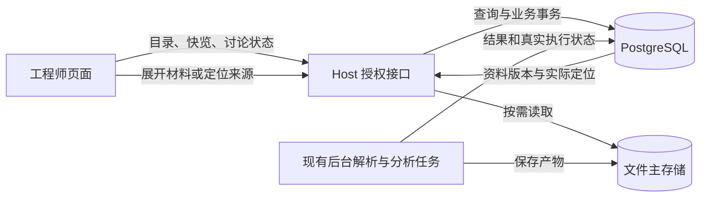

# 妙搭 Host 存储机制评估与改造建议

日期：2026-09-06。范围：WiseLink Host `app_17bzc551rsg`，设计核对基于已发布提交 `d1bd56b1d`。用户随后授权继续开发，第一批实际定位登记、受理短事务、数据库目录/快览及同轮读取复用已实现并通过本地验证；仅 dev 新增轻量 locator 表，待正常技术发布同步。未切换文件后端、修改审计设置、恢复/清理数据或改写历史引用。发布与真实新资料证据以 [当前执行计划](WISELINK_R10_EXECUTION_PLAN.md) 为准。

## 判断

**继续业务开发，同时改善正常路径；旧对象失联转为独立平台支持事项，不再作为开发、联调或正常技术发布的前置条件。** 保留 PostgreSQL 与 FileService 基本分工，分别回答事故原因与正常受理/读取如何组织，二者不互相冒充验收。

2026-09-06 10:25 用户要求直接替换此前“先查清旧事故再继续”的顺序。第一批只聚焦实际定位登记、必要短事务、数据库目录/快览、同轮读取复用，与前端和消费者连续使用一起交付。独立恢复平台、恢复副本接入、同步双写、保护等级与多后端切换暂不实施；已有备份及事故证据保留。旧事故未取得平台最终原因，新资料或结构优化成功不能反推事故已解释。

## 对照的官方资料与边界

| 文档或实现 | 已核实内容 | 对设计的影响 |
| --- | --- | --- |
| [官方 CLI v1.0.87 应用文件说明](https://github.com/larksuite/cli/blob/v1.0.87/skills/lark-apps/references/lark-apps-file.md) | 文件按应用和路径寻址；文件域不提供 dev/online 环境参数；签名链接有时效；CLI 上传由平台分配路径，单文件上限 100 MB | 文件隔离不能照搬数据库的环境假设；签名链接仅用于临时访问。CLI 的限制不能代替运行时 SDK 的约定 |
| [官方数据库说明](https://github.com/larksuite/cli/blob/v1.0.87/skills/lark-apps/references/lark-apps-db.md) | 数据库区分环境；行审计可配置；PITR 窗口最长 7 天且受最近迁移限制 | 数据库恢复与原件留档分别设计；已查询到命令不等于本应用恢复已验证 |
| 当前安装的 `@lark-apaas/file-service` 0.1.2 README、类型和实现 | SDK 支持指定 `filePath`、`upsert:false`；返回 bucket/path/object ID 等元数据；默认 Blob 下载有 50 MB 限制，另有 `asStream()` | 当前自定义路径是 SDK 支持的用法；需要保留实际返回的定位信息并按文件大小选择读取方式 |
| 当前 `@lark-apaas/fullstack-nestjs-core` FileService 封装 | 通过应用上下文和指定 bucket 调用上述文件 SDK | 运行时保留平台身份及 SDK 调用路径；开发 CLI 不进入产品运行代码 |

SDK 本地依据：`node_modules/@lark-apaas/file-service/README.md`、`dist/index.d.ts`、`dist/index.js`；NestJS SDK 在 `dist/index.js` 中导入该 FileService。README 的部分上传返回示例较旧，具体字段以已安装类型和真实返回为准。

上述 API 资料没有给出足以验证本应用文件长期保留、文件级恢复和故障恢复时间的完整证据。仍需平台确认这些能力及配额，不能把“说明中未找到”写成“平台不存在”。

## 当前实现的合理部分与缺口

| 方面 | 当前证据 | 评估与改造方向 |
| --- | --- | --- |
| 业务真源 | WorkItem、DocumentVersion、讨论和执行状态保存在 PostgreSQL；原件和解析包在 FileService | 分工合理，继续使用现有业务主键、版本、权限与 ActionAttempt |
| 原始 PDF 入库 | 已保存 bucket、path、object ID，使用 `upsert:false`、实读比对及重复受理检查 | 保留这些措施；它们不提供平台级防删除或长期恢复保证 |
| 解析产物定位 | 普通 Artifact 描述只保留逻辑 ref、已有摘要、长度和类型；读取重新查默认 bucket 并派生路径 | 补齐实际定位登记。默认桶变化是需要防范的具体场景，但未被证明是本次事故原因 |
| 入库一致性 | 文件上传与数据库登记分步执行；已有幂等及孤儿文件恢复。`recordAcquisition` 的两次插入在该方法中未显式包为事务 | 明确各步骤的成功条件与责任，不假设文件和数据库跨服务原子提交；不能仅凭这个结构问题推断它导致旧对象失联，具体调整另按平台支持方式验证 |
| 保留与恢复 | 旧文件无法读回；已有私有取证副本；40 张表未开启行审计；PITR 预览与实际新增记录矛盾 | 保留证据，请平台解释对象状态与处理规则。审计/PITR 的不足不自动解释文件失联，也不转换为本轮建设恢复系统的要求。详情见[存储记录](WL31_HOSTED_STORAGE_INCIDENT_20260905.md) |
| 资料库首屏 | 客户端仍调用完整 `getDocumentParsingPage`；服务端先检查主解析包，再构建页面 | 授权列表与快览改用数据库轻量查询；材料故障保留在对应材料区，不传播为目录不可用 |
| 文档目录查询 | `listIngressDocuments` 读取版本/文档族连接结果后，在应用内过滤租户 | 将授权/租户条件和检索条件下推数据库，按实际查询加索引与分页，避免随全部历史版本增长搬运数据 |
| 大文件与内存 | PDF 使用流式下载，但会汇集为 Buffer，默认最大 100 MiB；普通解析包使用默认 Blob 下载后再转字节数组 | 解析包超过 SDK 的 50 MiB 边界会失败；大文件读取、解析并发和内存需一起控制，流式传输本身不等于内存恒定 |
| 校验成本 | 已有最多 32 项的完整校验结论复用，失败不作为成功保留；实际读取仍先下载完整包并核对字节 | 保留入库校验与权限核验，优化页面对整包的依赖；不重复建设已有校验缓存，也不以缓存冒充材料当前可读 |

关键代码入口：

- `server/modules/document-management/src/hosted/miaodaFileServiceArtifactStore.js`
- `server/modules/document-management/src/hosted/nest/miaoda-hosted-document-catalog.ts`
- `server/modules/unified-reader/miaoda-ordinary-artifact-store.adapter.ts`
- `server/modules/unified-reader/python-u0-full-package-validator.adapter.ts`
- `server/modules/canonical-host/canonical-host-vertical.service.ts`
- `server/modules/canonical-host/canonical-host-library-index.service.ts`
- `server/modules/work-item/miaoda-work-item.repository.ts`

### 本轮只读容量观察

线上聚合查询结果：11 条 WorkItem 的 `projection_json` 合计 75,310 bytes，最大单条 17,596 bytes；73 条 ActionAttempt 的任务和结果 envelope 合计 10,601,437 bytes，最大单条合计 435,537 bytes。这只是这些文本字段的字节数，不包含索引、其他列或数据库历史版本开销，不是全库占用或压测结果。

当前字段规模支持优先保留现有数据库。前端等待应先处理完整文件读取、串行依赖和查询范围；以后再依据真实字段增长与访问方式决定大结果拆分。已知故障样本的原 PDF 为 86,742 bytes，主解析包为 1,290,694 bytes，说明文件展开大小不能仅按原 PDF 大小估算；这一样本不代表所有文档的展开比例。

## 建议的目标机制

### 1. 资料身份与物理位置分别管理

业务继续引用现有资料 ID、DocumentVersion 和 SourceRef。存储模块统一持久登记 provider、bucket、path、object ID、已有内容标识、长度和类型；写入保存平台实际返回值，读取使用原登记，客户端与模型不能任意指定这些受控位置。

普通解析产物的 locator 调整消除“各业务模块重新查默认桶并派生路径”的职责差异，不是在失败后换桶重试。旧记录和原始引用保留，不猜新桶，不因查无记录自动判断可删除。这项结构优化尚未被证明是本次事故的针对性修复。

### 2. 按访问方式组织数据

| 类别 | 建议机制 |
| --- | --- |
| 目录、版本关系、讨论、执行状态及页面高频摘要 | 数据库直接支持授权范围内查询、过滤与分页，不依赖下载完整原件或解析包 |
| 原 PDF、图片及适合整体保存的大型产物 | 文件服务保存，按请求目的读取；实际定位由存储模块管理 |
| 章节、片段与检索投影 | 按真实访问需要持久化，并明确绑定原 DocumentVersion/解析版本；不是可独立修改的第二套事实 |
| 缓存与隔离测试材料 | 与原件和业务事实明确区分；缓存不冒充当前可读证据，测试不覆盖旧对象或触发正式业务 |

这里不是将所有 JSON 搬入数据库；依据查询频率、粒度与大小决定位置。需要整体解析的大型包仍保留，页面高频结构化查询不再反复展开整包。

文件 API 未提供数据库式环境参数；受控对照必须先限定非业务内容、归属与独立对象范围。目录前缀只是组织方式，不作为权限隔离或持久保留语义的证据。具体生命周期、引用登记及存储归属要求仍须平台确认。

### 3. 读取按用途分开

- 目录与快览：数据库查询真实授权范围、编号、标题、版本、阶段、摘要及已知读取状态，支持搜索和分页，不下载原件或主解析包。
- 正文与 SourceRef：用户展开时按章节或实际需要的片段读取。可从已有解析包建立与原资料版本绑定的读取索引，保持原包及来源关联。
- 分析任务：复用既有队列与 ActionAttempt，读取所需材料、保存结果及真实失败原因；保留正式采用和当前权限检查。
- 大文件：使用 SDK 流式能力、明确大小和并发限制，避免在页面请求中复制多份完整字节。需要整包的解析和初次完整校验由后台任务承担。
- 临时访问与缓存：按需签发链接；缓存绑定身份、资料版本和实际授权，失效可重建，不能掩盖源文件不可读。

当前 `library-index` 是单事项接口，并且还会加载完整事项投影；需要补成真正的轻量目录与快览查询。现有 owner-only 查询可以复用权限原则，但其最多 50 条结果不能冒充完整可分页资料库。

## 实施顺序与验证

1. **四项与业务并行实现。** SDK 实返定位仅登记在存储内部，原件继续复用既有登记；短事务只包含共同提交的源文件/受理记录；目录在数据库按既有权限搜索与稳定分页，快览只选已有结果必要字段；相同请求/任务复用绑定明确版本的实际字节、解析和内容单元，不复用权限决定。
2. **用非事故资料推进真实流程。** 优先获准已有可读资料，必要时正常受理真正不同的新资料，不改名重传旧文件或改变内容规避去重。用户已指定 `/Volumes/SSD/LLM/WiseLink/Docs/uploads` 中的 PDF，并允许多文档测试及按需要调整现有自动执行范围。资料受理、目录/快览、原文、初始候选和至少两轮连续 Review（含方向纠正或补材料）共同验收，不正式采用。
3. **直接测量正常读取行为。** 列表/快览零主包下载，同次装配无不必要的重复下载/解析，单个来源失败不影响其他已授权事项；再观察传输量、峰值内存与阶段耗时，不宣称固定提速比例。`.asStream()` 后仍汇集 Buffer 不算恒定内存。
4. **旧事故独立支持。** 围绕已知原对象、原桶/路径和 Trace 请求平台底层存在性、索引/归属/权限及删除清理生命周期记录；必要的同内容官方/真实 SDK 对照限获准隔离范围，不覆盖旧对象或历史引用。平台根因与对应修复独立交付，未复现不等于事故关闭。

只有查明平台持久存储语义确实无法满足需求后，才讨论文件后端替换。现有保护、备份与权限保留；独立恢复平台、同步双写和多后端切换不进入本阶段实施范围。

当前已开始实现四项改进；开发库已新增轻量普通产物定位登记表并经官方工具生成类型，尚未迁移线上或发布。页面和消费者接线正在验证，尚未上传新测试资料、迁移自动执行范围或取得新资料连续候选证据；旧事故最终原因仍未查清。
